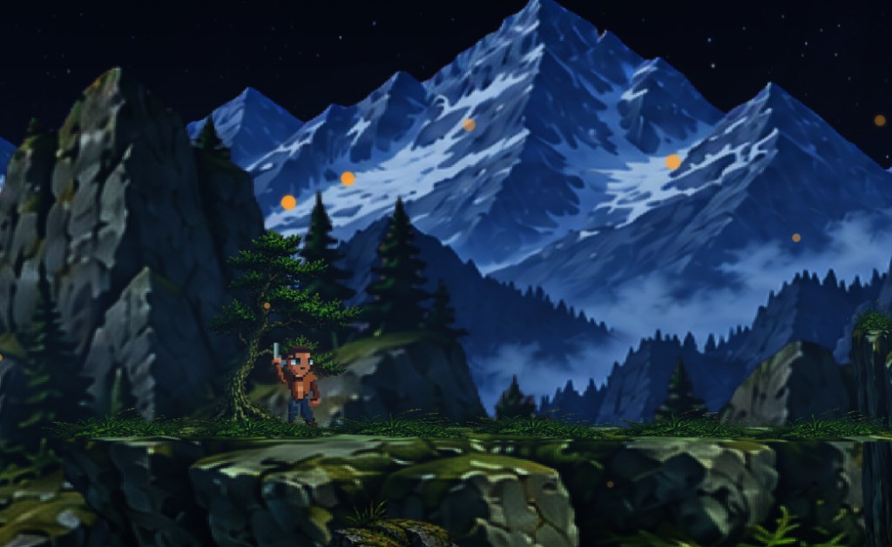

# ForgEng 2D Template

<p align="center">
  
</p>

<p align="center">
  <em>2D adventure mood board — pixel character, layered parallax world, atmospheric night scene</em>
</p>

**TypeScript starter template for browser games** built with **[ForgEng](https://forgeng.dev)** — a **WebGPU-first**, modular game engine that runs directly in modern browsers (no native runtime install).

This repository is the **2D** starter sibling of [`forgeng-3d-template`](https://github.com/ForgEngDev/forgeng-3d-template). Use it to bootstrap client-side 2D games with Vite + TypeScript, then grow into the full ForgeNG 3.0 stack documented at [forgeng.dev](https://forgeng.dev).

> Keywords: `ForgEng`, `ForgeNG`, `TypeScript`, `WebGPU`, `2D game template`, `Vite`, `browser game engine`, `WGSL`, `ECS`, `transport`, `sprites`, `tilemaps`

## Why this template

[ForgEng / ForgeNG 3.0](https://forgeng.dev/en/forgeng-3.0/getting-started/overview) is the current stable **browser-first TypeScript** engine release. Public docs describe it as combining:

- a **production 2D runtime** (sprites, tilemaps, text, particles, cameras, animation, collision, lighting, masks, hybrid composition)
- the established **scene / ECS / 3D WebGPU** runtime under the same lifecycle owner
- **versioned provider contracts** for input/actions, audio, physics, assets, gameplay, storage, **transport**, UI, animation and rendering
- manifest-driven assets, compressed formats, opt-in devtools and bounded performance observability

The marketing site positions the engine as **type-safe, GPU-first, web-native**: modern **WebGPU** pipelines, **WGSL** shaders, lighting, materials, shadows and post-processing, with composable scenes, ECS, providers and plugins — delivered as ordinary web assets on desktop/mobile browsers that support WebGPU ([forgeng.dev](https://forgeng.dev/en)).

This template gives you a **minimal, runnable 2D game shell** on that foundation so you can start making games immediately.

## What you get in *this* repo

A focused **2D starter** (not the full engine surface):

- `Forge2d.create` engine entry (Phaser-style: config in `main.ts`, content in `src/scene/`)
- pixel-art camera (**320×180**, integer-fit, nearest sampling)
- orange hero + platform + wall collider (deterministic overlap rollback)
- WASD / arrows movement, Space / pointer actions, E reset, Q animation toggle
- DomUiShell side panel: **Kontrole** + optional **Metrike** (`?advanced=1`)
- vendored ForgeNG **2D preset** + DomUiShell under `src/vendor/forgeng/`

## Engine capabilities you can grow into

Documented on [forgeng.dev](https://forgeng.dev) / ForgeNG 3.0 docs (not all enabled in this starter by default):

| Area | Publicly documented direction |
| --- | --- |
| Rendering | WebGPU-only runtime (no silent fallback to another renderer); GPU pipelines, WGSL, lighting, shadows, post-processing |
| 2D gameplay | Sprites, tilemaps, text, particles, cameras, animation, collision, lighting, masks, hybrid 2D/3D composition |
| Architecture | Explicit scenes, ECS, replaceable providers/plugins behind versioned contracts |
| Systems | Input/actions, audio, physics, assets, gameplay, storage, UI, animation, rendering |
| Networking | **Opt-in transport** composition (`forgeng/transport`, optional reconnect). Contract is DOM-neutral and binary-only; ForgeNG does not ship a signaling service with the SDK ([Transport Composition](https://forgeng.dev/en/forgeng-3.0/advanced/transport-composition)) |
| Delivery | Deploy as web assets; share demos/games by opening a page in a WebGPU browser |

> Honest scope note: this template demonstrates **2D scene + input + UI**. Features such as multiplayer transport, physics providers, asset codecs (Draco/meshopt/KTX2), or 3D rendering are part of the broader ForgeNG ecosystem and docs — wire them in when your game needs them.

## Requirements

- Git (to clone this repository)
- Node.js 18+
- A browser/device with **WebGPU** support (ForgeNG 3.0 does not silently switch renderer)

## Quick start

```bash
git clone https://github.com/ForgEngDev/forgeng-2d-template.git
cd forgeng-2d-template
npm install
npm run dev
```

Open [http://localhost:3001/](http://localhost:3001/).

```bash
npm run build
npm run preview
```

## Project layout

```text
src/
  main.ts              # Forge2d.create — canvas, providers, scenes
  scene/
    mainScene.ts       # setup, fixedUpdate, HUD wiring
    render.ts          # layers, camera, sprites, animations
    camera.ts
    ground.ts          # platform + wall
    hero.ts            # player sprite + idle/walk
    controller.ts      # WASD / mouse / touch + Input Actions
    hud.ts             # DomUiShell panels
    ids.ts
  vendor/forgeng/      # vendored 2D preset + DomUiShell
css/style.css
index.html
```

## Controls

| Input | Action |
| --- | --- |
| WASD / arrows | Move hero |
| Space / left click / tap | Action toast |
| E | Reset hero position |
| Q | Pause / resume walk–idle animation |
| Right / middle click | Secondary / tertiary toast |

Advanced metrics: side-panel toggle or `?advanced=1`.

## Learn more

- Website: [https://forgeng.dev](https://forgeng.dev)
- Docs (3.0 overview): [https://forgeng.dev/en/forgeng-3.0/getting-started/overview](https://forgeng.dev/en/forgeng-3.0/getting-started/overview)
- Transport (opt-in networking composition): [https://forgeng.dev/en/forgeng-3.0/advanced/transport-composition](https://forgeng.dev/en/forgeng-3.0/advanced/transport-composition)
- Demos: [https://forgeng.dev/en](https://forgeng.dev/en) → Demos
- 3D sibling template: [forgeng-3d-template](https://github.com/ForgEngDev/forgeng-3d-template)

## License

See [LICENSE](./LICENSE).

- **Template / game code:** free to use and improve for client-side games.
- **ForgEng engine** (vendored under `src/vendor/forgeng/`): installation on other computers as an engine/SDK and commercial use of the engine are strictly forbidden.

Engine ownership and commercial grants are also described on the public [ForgeNG License](https://forgeng.dev/en/license) page.
